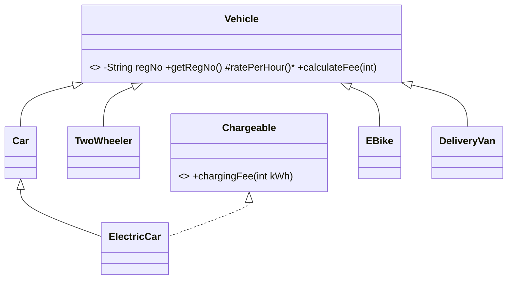

# UML class diagram (Task 6) - paste into mermaid.live or GitHub renders it

```mermaid
classDiagram
  class Vehicle { <<abstract>> -String regNo +getRegNo() #ratePerHour()* +calculateFee(int) }
  class Chargeable { <<interface>> +chargingFee(int kWh) }
  Vehicle <|-- TwoWheeler
  Vehicle <|-- Car
  Car <|-- ElectricCar
  Chargeable <|.. ElectricCar
  Vehicle <|-- EBike
  Vehicle <|-- DeliveryVan
```
